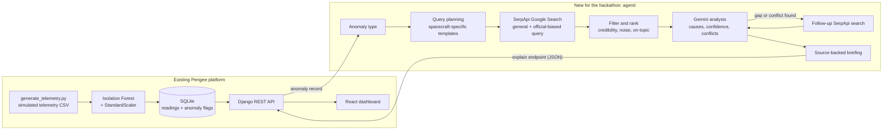

# Perigee: Satellite Health Dashboard + Search-Grounded Anomaly Explainer

> **SerpApi India Hackathon 2026 | Track: AI Agents**
>
> Perigee existed before the hackathon: an ML anomaly detector, a Django REST API and a React dashboard. **New for the hackathon: the `agent/` folder**, an AI agent that explains each flagged anomaly using live evidence retrieved through **SerpApi**.
>
> **Demo video:** [ADD_YOUR_VIDEO_LINK_HERE](ADD_YOUR_VIDEO_LINK_HERE)

<!-- Optional: add a screenshot before submitting

-->

## Table of contents
1. [The problem](#the-problem)
2. [What Perigee does](#what-perigee-does)
3. [Features](#features)
4. [Architecture](#architecture)
5. [How SerpApi is used](#how-serpapi-is-used)
6. [The agent in detail](#the-agent-in-detail)
7. [Sample output](#sample-output)
8. [Tech stack](#tech-stack)
9. [Project structure](#project-structure)
10. [Full setup instructions](#full-setup-instructions)
11. [API endpoints](#api-endpoints)
12. [Dataset](#dataset)
13. [Hackathon submission details](#hackathon-submission-details)
14. [Honest limitations](#honest-limitations)
15. [Future work](#future-work)

---

## The problem

Anomaly detectors tell a satellite operator **that** something is wrong. They rarely tell the operator **why**. Finding likely causes means searching technical papers, agency reports and news, and judging which sources deserve trust.

## What Perigee does

Perigee has two parts that work together.

**1. Detect (existing project).** Perigee monitors simulated satellite telemetry (temperature, battery level, power draw, orientation, communication signal strength) and flags anomalies with an Isolation Forest model. A Django REST API serves the data to a React dashboard with live stats, trend charts, an anomaly breakdown and a table of flagged readings.

**2. Explain (new for the hackathon).** For a flagged anomaly, the agent searches the web through SerpApi, filters and ranks the sources by credibility, and has an LLM read only those sources to produce a short briefing: likely causes with confidence levels, source citations, and any conflicting claims. If the evidence has a gap or conflict, the agent decides to run one more targeted search and re-analyzes.

## Features

**Detection and dashboard (existing project)**
- **Anomaly detection** on 7 telemetry features using an Isolation Forest model with a fitted `StandardScaler`
- **REST API** built with Django REST Framework, exposing telemetry data, filtered anomalies and summary statistics
- **Interactive dashboard** built with React and Recharts:
  - Live stats cards (total readings, anomaly count, anomaly rate)
  - Multi-metric telemetry trend line chart
  - Anomaly breakdown by type (bar chart)
  - A table of the most recent flagged anomalies
- **Ground-truth anomaly labels** in the dataset for evaluating the model

**Search-grounded explanations (new for the hackathon)**
- **Live evidence from SerpApi** for each anomaly type, using a general query and an official-biased query
- **Source credibility labels** (official, research, news/other) from deterministic domain rules
- **Noise and relevance filtering** that drops social media and off-topic results
- **Model-driven follow-up search** when the analysis finds a gap or conflict
- **Grounded output:** causes with source citations and confidence levels, conflicts when sources disagree
- **Caching and retry logic** to save search quota and survive temporary LLM overload

## Architecture



In plain text, the agent pipeline is:

```
anomaly type -> query templates -> SerpApi search (general + official-biased)
             -> dedupe, drop noise, keep on-topic, label and rank sources
             -> Gemini reads ONLY those sources -> causes + confidence + conflicts
             -> (if gap/conflict) one follow-up SerpApi search -> re-analyze
             -> final briefing with labeled sources
```

## How SerpApi is used

- **Engine:** Google Search through the official Python SDK (`serpapi`), with `gl=in` and `hl=en`.
- **Two queries per anomaly:** a general spacecraft-specific query, and a second query restricted to `site:nasa.gov OR site:esa.int OR site:isro.gov.in` to pull in official sources.
- **The explanation depends on the search results.** The LLM is instructed to use only the retrieved sources, and each cause cites source numbers. Without the SerpApi results there is nothing to analyze.
- **The agent decides on extra searches.** The model reports whether a conflict or gap needs another search and proposes the query. The number of searches therefore depends on the evidence.
- **Result handling uses SerpApi fields directly:** the `link` of every result drives the credibility label (official, research, or news/other), and titles and snippets feed the analysis.
- **Quota-aware:** SerpApi responses are cached on disk, so repeated runs do not spend extra searches.

## The agent in detail

| Step | File | What happens |
|---|---|---|
| 1. Query planning | `agent/searcher.py` | Rule-based query templates per anomaly type (`power_surge`, `orientation_drift`, `comms_dropout`, `battery_drop`, `temp_spike`) |
| 2. Search | `agent/searcher.py` | SerpApi Google Search: one general query and one official-biased query, five results each |
| 3. Filter and rank | `agent/searcher.py`, `agent/credibility.py` | Remove duplicates and social-media noise, keep only space-related results (relevance filter), label each source by domain rules, rank official > research > news/other |
| 4. Analyze | `agent/llm.py`, `agent/orchestrator.py` | Gemini reads the numbered sources and returns JSON: summary, causes with source citations and confidence, conflicts, and whether a follow-up search is needed |
| 5. Follow up | `agent/orchestrator.py` | If requested, run one more official-biased SerpApi search with the model's query, merge new on-topic sources, and re-analyze |
| 6. Output | `agent/orchestrator.py` | Briefing with causes, conflicts, whether a follow-up ran, and the labeled source list |

Design choices:

- **Deterministic credibility layer.** Source labels come from plain domain rules, not from the LLM, so the trust signal is predictable and auditable.
- **Grounded prompting.** The prompt forbids outside knowledge, requires source citations, and tells the model to report low confidence when sources are thin or off-topic.
- **Reliability.** LLM calls retry with backoff on overload (HTTP 429/5xx), optional fallback models can be set with `GEMINI_FALLBACK_MODELS`, and successful responses are cached.

## Sample output

Real output from `python -m agent.orchestrator power_surge` (abbreviated):

```
SUMMARY: The power surge anomaly may be caused by spacecraft charging and sudden electrical
discharge induced by space weather or geomagnetic storms, which can damage power electronics.
Alternatively, it could indicate an internal power system failure or power system explosion
hazard. Because the sources provide general space weather mechanisms rather than
subsystem-specific telemetry benchmarks, confidence is moderate to low.

- Induction and sudden release of electrical charge from geomagnetic storms and space plasma
  causing power electronic failures (confidence: medium, sources: [1, 2, 3, 4])
- Internal power system explosion or catastrophic power failure (confidence: low, sources: [0, 3])
- Surface charging and electrostatic discharge resulting from electron accumulation on
  spacecraft surfaces (confidence: low, sources: [6, 10])

CONFLICTS: none

FOLLOW-UP SEARCH USED: True  causes of spacecraft power surge telemetry anomalies
                             electrostatic discharge space weather

SOURCES:
[0] [official] Spacecraft Anomalies and Failures Workshop 2023   (ntrs.nasa.gov)
[1] [research] Exploring the Impact of Space Weather on Satellite Communications
[2] [research] Understanding space weather phenomena responsible for different impacts on
               spacecraft during the May 2024 extreme geomagnetic storm
...
```

When the evidence is thin, the agent says so instead of guessing. For example, the `battery_drop` anomaly returns low-confidence causes and a note that the sources lack operational detail.

## Tech stack

| Layer | Technology |
|---|---|
| ML / data | Python, Pandas, scikit-learn (Isolation Forest, StandardScaler), joblib |
| Backend | Django, Django REST Framework, SQLite |
| Frontend | React (Vite), Recharts, Axios |
| Agent (new) | Python, SerpApi Python SDK (`serpapi`), Google Gemini (`google-genai`), `python-dotenv` |
| Tooling | Git, VS Code |

## Project structure

```
perigee/
├── .env.example          # names of required environment variables (no secrets)
├── .gitignore
├── README.md
├── agent/                # NEW for the hackathon
│   ├── credibility.py    # rule-based source labels (official / research / news-other)
│   ├── searcher.py       # SerpApi searches, filtering, ranking, disk cache
│   ├── llm.py            # Gemini calls with retry, optional fallback models, cache
│   └── orchestrator.py   # analysis, follow-up search, CLI entry point
├── backend/
│   ├── perigee_backend/  # Django project settings and root URLs
│   ├── telemetry/        # models, serializers, views, routes, load_telemetry command
│   ├── manage.py
│   └── requirements.txt
├── frontend/             # React (Vite) dashboard
│   └── src/              # api, components, App.jsx
└── ml/
    ├── data/             # generate_telemetry.py, telemetry.csv
    ├── models/           # anomaly_detector.py, isolation_forest.joblib
    └── notebooks/        # exploratory analysis
```

## Full setup instructions

### Prerequisites
- Python 3.11 or newer
- Node.js 18 or newer (only for the dashboard)
- A **SerpApi API key**: create a free account at [serpapi.com](https://serpapi.com) and copy the key from the "Manage API key" page. The free plan has a limited number of searches per month.
- A **Gemini API key** from [Google AI Studio](https://aistudio.google.com)

### 1. Clone and create a virtual environment
```bash
git clone https://github.com/shlokaloni282/Perigee.git
cd Perigee
python -m venv .venv
```
Activate it:
```powershell
# Windows PowerShell
.\.venv\Scripts\Activate.ps1
```
```bash
# macOS / Linux
source .venv/bin/activate
```

### 2. Install Python dependencies
```bash
python -m pip install -r backend/requirements.txt
```

### 3. Add your API keys
Copy `.env.example` to `.env` in the **project root** and fill in the values:
```
SERPAPI_API_KEY=your_serpapi_key
GEMINI_API_KEY=your_gemini_key
GEMINI_MODEL=gemini-3.8-flash
```
`.env` is git-ignored. Never commit it.

Optional: `GEMINI_FALLBACK_MODELS=<comma-separated model names>` lets the agent fall back to other models if the primary one is unavailable. If `gemini-3.8-flash` is not available for your account, set `GEMINI_MODEL` to a model listed in Google AI Studio.

### 4. Run the anomaly explainer (the hackathon agent)
From the project root:
```bash
python -m agent.orchestrator power_surge
```
Supported anomaly types: `power_surge`, `orientation_drift`, `comms_dropout`, `battery_drop`, `temp_spike`.

The agent picks the first labeled anomaly of that type from `ml/data/telemetry.csv`, runs the search and analysis, and prints the briefing. A first run uses roughly 3 to 4 SerpApi searches and 1 to 2 Gemini calls. Results are cached in `agent/cache/`, so repeat runs are free. Delete that folder to force a fresh live run.

### 5. Run the dashboard and API (optional)
Backend:
```bash
cd backend
python manage.py makemigrations telemetry
python manage.py migrate
python manage.py load_telemetry    # loads the CSV and runs anomaly detection
python manage.py runserver
```
The API runs at `http://127.0.0.1:8000`. Quick check: open `http://127.0.0.1:8000/api/telemetry/stats/`. You should see 720 readings and 21 anomalies.

Frontend (second terminal):
```bash
cd frontend
npm install
npm run dev
```
The dashboard runs at `http://localhost:5173`. Start the backend first, because the dashboard fetches live data from it.

### Troubleshooting
- **`SERPAPI_API_KEY not found` or `GEMINI_API_KEY not found`:** `.env` must be in the project root, with no quotes around the values.
- **Gemini 503 "high demand":** temporary. The agent retries automatically with backoff. Try again in a minute.
- **Gemini 404 "model not found":** set `GEMINI_MODEL` in `.env` to a model available to your account.
- **`No module named 'agent'`:** run the command from the project root, not from inside `agent/` or `backend/`.
- **Duplicate readings (counts doubled):** delete `backend/db.sqlite3`, then re-run `migrate` and `load_telemetry`.

## API endpoints

| Endpoint | Description |
|---|---|
| `GET /api/telemetry/` | All telemetry readings |
| `GET /api/telemetry/anomalies/` | Readings flagged as anomalies by the model |
| `GET /api/telemetry/stats/` | Total readings, anomaly count, anomaly rate |
| `GET /api/telemetry/anomalies/<id>/explain/` | *(New, experimental)* runs the search agent for one flagged anomaly and returns the briefing as JSON. The primary way to run the agent is the CLI above. |

## Dataset

Thirty days of simulated hourly satellite readings (720 rows) with these columns: `timestamp, temperature_c, battery_pct, power_draw_w, orientation_pitch, orientation_roll, orientation_yaw, comms_signal_pct, is_anomaly, anomaly_type`.

`is_anomaly` and `anomaly_type` are ground-truth labels injected by the generator. The dataset contains 21 labeled anomalies: `power_surge` (8), `orientation_drift` (6), `comms_dropout` (4), `battery_drop` (2) and `temp_spike` (1). The Isolation Forest is trained on seven telemetry features.

## Hackathon submission details

| Item | Answer |
|---|---|
| Hackathon | SerpApi India Hackathon 2026 (Sep 1 to Oct 10, 2026, IST) |
| Track | AI Agents |
| Existed before the hackathon? | **Yes.** The ML detector, Django API and React dashboard existed before. The `agent/` folder and the explain endpoint were built during the hackathon, and the commit history shows the dates. |
| SerpApi products used | Google Search through the official Python SDK (`serpapi`) |
| Why SerpApi matters here | Every explanation is built from retrieved sources. The model is told to use only those sources, and the agent can decide to run an extra search based on what it finds. |
| AI tools used | **Claude** for coding assistance during development. **Gemini** inside the app to analyze the retrieved sources. |
| Demo video | See the link at the top of this README. It shows the project running locally. |
| Secrets | No API keys or personal data are committed. Keys live in a git-ignored `.env`. |

**How the project maps to the judging criteria**

- **Idea strength:** closes the gap between "an anomaly was detected" and "here is what usually causes it, with sources."
- **Originality:** combines a trained ML detector with a search-grounded agent, rule-based source credibility, and a model-driven follow-up search, in a spacecraft-specific setting.
- **Technical complexity:** ML model, REST API, dashboard, and a multi-step agent with caching, retry logic and relevance filtering.
- **Usefulness:** gives operators, students and engineers a starting point for diagnosing spacecraft faults, with transparent sources.
- **Meaningful SerpApi usage:** the explanation cannot be produced without the search results, and the agent's behavior (follow-up search) depends on them.

## Honest limitations

- **The telemetry is simulated.** The agent finds real-world references for each anomaly *type*. It is not monitoring a real satellite, and the timestamps are not tied to real events.
- **Evidence quality varies by anomaly type.** Some types (for example `battery_drop`) return thin evidence. The agent then reports low confidence instead of guessing.
- **Source labels are domain-based heuristics.** A source labeled "research" or "news/other" is not verified beyond its domain.
- **Query planning is template-based** per anomaly type, not LLM-generated.
- **No formal evaluation yet.** The sample runs were checked by hand. Conflicts were not flagged in them, because the retrieved sources did not contradict each other.
- The explain endpoint is new and experimental; the dashboard does not have an "Explain" button yet.
- Outputs come from an LLM reading search snippets, so they are a starting point for investigation, not an engineering conclusion.

## Future work

- An "Explain" button in the React anomaly table that calls the explain endpoint
- Additional SerpApi engines (Google News for current space-weather context, Google Scholar for papers)
- An evaluation on the labeled anomalies (cause-category match, share of official/research sources)
- LLM-assisted query planning and time-series forecasting of telemetry
- Real-time streaming data and deployment (Render/Railway for the backend, Vercel for the frontend)

---

Built by **Shloka Loni**.
